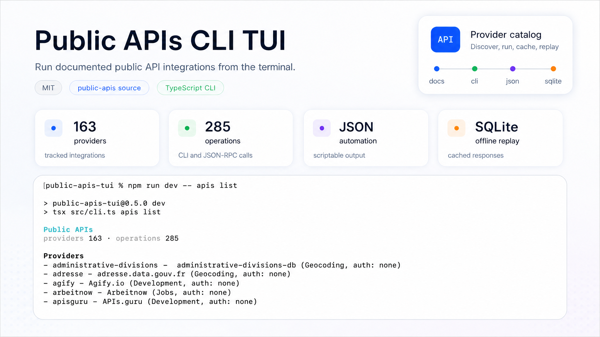
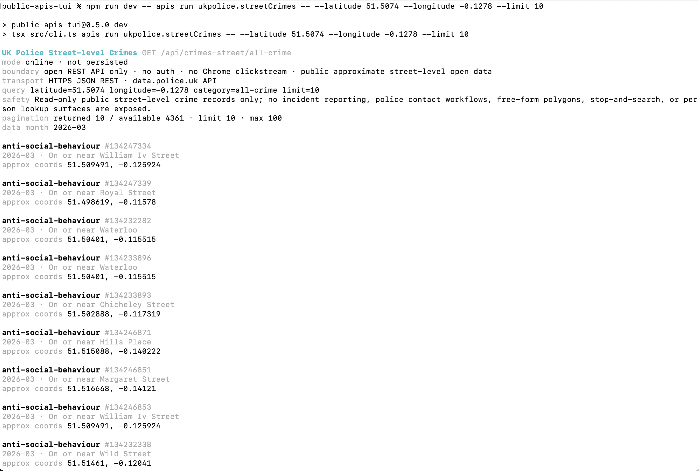
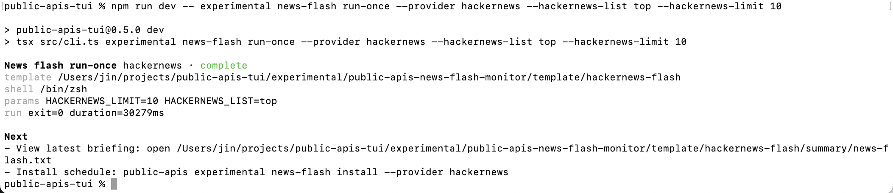
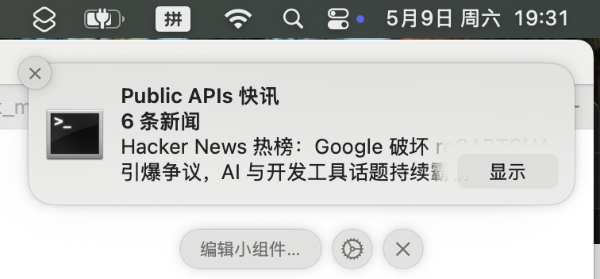

# Public APIs CLI

[English README](./README.md)

用于运行已文档化 public API 集成的终端 CLI。
它提供 provider 发现、带类型约束的 operation 帮助、可读文本输出、
JSON 输出、本地 API Key 配置、SQLite 持久化和离线回放
（offline replay），也包含实验性新闻快报监控模板
（experimental news-flash monitors）。



## 安装

```sh
npm install -g public-apis-cli
public-apis version
public-apis apis list
```

不全局安装也可以使用：

```sh
npx public-apis-cli version
npx public-apis-cli apis list
```

## 核心命令

- 查看版本：`public-apis version`
- 列出 providers 和 operations：`public-apis apis list`
- 查看一个 provider：`public-apis apis info ukpolice`
- 查看 operation 参数：`public-apis apis run ukpolice.streetCrimes --help`
- 运行 operation：

```sh
public-apis apis run ukpolice.streetCrimes -- \
  --latitude 51.5074 \
  --longitude -0.1278 \
  --limit 5
```

- 输出 JSON：

```sh
public-apis apis run hackernews.stories --format json -- --limit 5
```

- 配置 provider：`public-apis apis config newsapi`
- 查看缓存：`public-apis apis cache list ukpolice`
- 运行 JSON-RPC：见下面的 JSON-RPC 章节。

`--` 前面是通用 runner 参数，后面是 provider operation 参数。

## Provider 示例

### UK Police，无需认证

```sh
public-apis apis info ukpolice
public-apis apis run ukpolice.streetCrimes -- \
  --latitude 51.5074 \
  --longitude -0.1278 \
  --category all-crime \
  --limit 10
```



### Hacker News，无需认证

```sh
public-apis apis run hackernews.stories -- --list top --limit 10
public-apis apis run hackernews.thread -- --id 8863 --limit 20
```

### Spaceflight News，无需认证

```sh
public-apis apis run spaceflightnews.articles -- --search artemis --limit 10
public-apis apis run spaceflightnews.articles --format json -- \
  --news-site NASA \
  --limit 5
```

### NewsAPI，需要 API Key

```sh
public-apis apis config newsapi --set-secret NEWSAPI_API_KEY=your_key
public-apis apis run newsapi.headlines -- \
  --country us \
  --category technology \
  --page-size 10
```

配置输出会把密钥显示成 `<redacted>`。原始配置默认在
`~/.cdp-cli/public-apis-cli/public-apis/<provider>/config.json`。

### GNews，需要 API Key

```sh
public-apis apis config gnews --set-secret GNEWS_API_KEY=your_key
public-apis apis run gnews.headlines -- \
  --category technology \
  --country us \
  --max 10
```

## API Key 配置

优先用 provider config 存密钥，避免把密钥写进 shell history。

```sh
public-apis apis config newsapi --set-secret NEWSAPI_API_KEY=your_key
public-apis apis config gnews --set-secret GNEWS_API_KEY=your_key
public-apis apis config mediastack --set-secret MEDIASTACK_API_KEY=your_key
```

查看或删除密钥：

```sh
public-apis apis config newsapi
public-apis apis config newsapi --unset-secret NEWSAPI_API_KEY
```

Provider client 支持时，密钥解析顺序通常是：

1. 显式 CLI 参数，例如 `--api-key`；
2. 环境变量，例如 `NEWSAPI_API_KEY`；
3. `apis config` 写入的本地 provider config。

## 持久化和离线回放

保存一次在线结果：

```sh
public-apis apis run ukpolice.streetCrimes --online --persist -- \
  --latitude 51.5074 \
  --longitude -0.1278 \
  --limit 5
```

不访问上游 API，直接离线回放：

```sh
public-apis apis run ukpolice.streetCrimes --offline -- \
  --latitude 51.5074 \
  --longitude -0.1278 \
  --limit 5
```

把持久化设为 provider 默认行为：

```sh
public-apis apis config ukpolice --persist --default-mode online
public-apis apis cache list ukpolice
public-apis apis cache clear ukpolice
```

Offline replay 适合测试、演示、调试不稳定上游。

## 实验性新闻快报

npm 包会包含 `experimental/public-apis-news-flash-monitor/` 下的
新闻快报模板（news-flash templates）。这些模板可以定期轮询选定
provider，让 agent CLI 生成摘要，渲染 TXT 快报，并安装 macOS
LaunchAgent 调度。

```sh
public-apis experimental news-flash providers
public-apis experimental news-flash run-once --provider hackernews
public-apis experimental news-flash install --provider spaceflightnews \
  --interval-minutes 30
```

默认 runner 是 `claude_code`。要切到 Codex，使用
`--agent-cli-runner codex` 和 `--codex-profile <profile>`。Runner
凭据可以来自 shell startup files、`--agent-env NAME=value`，或
`--agent-env-file <path>`。Monitor 会桥接（bridge）Claude 的
`ANTHROPIC_*` 设置，也会从 `CODEX_CONFIG_FILE`、`CODEX_HOME/config.toml`
或 `~/.codex/config.toml` 读取 Codex `model_providers.*.env_key`
声明的环境变量名。

模板需要显式仓库或包根目录时，使用
`PUBLIC_APIS_CLI_REPO=/path/to/public-apis-cli`。旧的
`PUBLIC_APIS_TUI_REPO` 仍作为兼容回退（compatibility fallback）。




## JSON-RPC

通过 stdin/stdout 启动 line-delimited JSON-RPC server：

```sh
printf '%s\n' \
  '{"jsonrpc":"2.0","id":1,"method":"hackernews.stories","params":{"limit":3}}' \
  | public-apis rpc
```

当另一个 agent 或进程需要稳定命令面时，用 JSON-RPC。

## 边界规则

- 只使用官方文档里的 REST 或 JSON endpoint。
- API Key 存在本地 provider config，不写进命令历史。
- 文本输出是结构化 JSON result 的投影。
- 支持从本地 SQLite cache 离线回放。

## 故障处理

### `Unknown operation`

先查 provider 和 operation：

```sh
public-apis apis list
public-apis apis info <provider>
```

然后使用精确 operation id，例如 `ukpolice.streetCrimes`。

### Provider 参数没有生效

Provider 参数必须放在 `--` 后面：

```sh
public-apis apis run hackernews.stories -- --list top --limit 10
```

错误写法：

```sh
public-apis apis run hackernews.stories --list top --limit 10
```

### 已配置 API Key，但 provider 仍说缺 key

检查 provider config：

```sh
public-apis apis config newsapi
```

### Offline mode 没有结果

先保存一次在线结果：

```sh
public-apis apis run ukpolice.streetCrimes --online --persist -- \
  --latitude 51.5074 \
  --longitude -0.1278 \
  --limit 5
public-apis apis run ukpolice.streetCrimes --offline -- \
  --latitude 51.5074 \
  --longitude -0.1278 \
  --limit 5
```

## License

MIT。见 [LICENSE](./LICENSE)。
